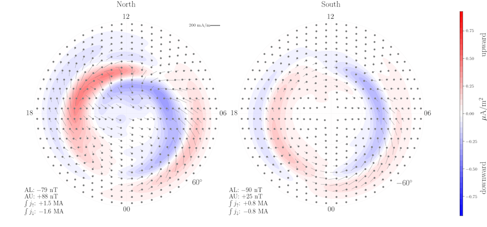

Overview
========

Python interface for the Average Magnetic field and Polar current System (AMPS) model.

.. image:: ./animation.gif
   :align: left
   
The AMPS model is an empirical model of the ionospheric current system and associated magnetic field. The model magnetic field and currents are continuous functions of solar wind velocity, the interplanetary magnetic field, the tilt of the Earth's dipole magnetic field with respect to the Sun, and the 10.7 cm solar radio flux index F10.7. Given these parameters, model values of the ionospheric magnetic field can be calculated anywhere in space, and, with certain assumptions, on ground. The full current system, horizontal + field-aligned, are defined everywhere in the polar regions. The model is based on magnetic field measurements from the low Earth orbiting Swarm and CHAMP satellites.

pyAMPS can be used to calculate and plot average magnetic field and current parameters on a grid. The parameters that are available for calculation/plotting are:

- field aligned current (scalar)
- divergence-free current function (scalar)
- divergence-free part of horizontal current (vector)
- curl-free part of horizontal current (vector)
- total horizontal current (vector)
- eastward or northward ground perturbation corresponding to equivalent current (scalars)

Installation
------------

Using pip::

    pip install pyamps

Dependencies:

- numpy
- dask
- matplotlib
- scipy (scipy.interpolate for plotting purposes)
- pandas (for reading csv file containing model coefficients)
- apexpy (magnetic coordinate conversion)

Example usage
-------------
.. code-block:: python

    >>> # initialize by supplying a set of external conditions:
    >>> from pyamps import AMPS
    >>> m = AMPS(350, # Solar wind velocity in km/s 
                  -4, # IMF By (GSM) in nT
                  -3, # IMF Bz (GSM) in nT, 
                  20, # dipole tilt angle in degrees 
                  80) # F107_index
    >>> # make summary plot:
    >>> m.plot_currents()

.. code-block:: python

    >>> # All the different current functions can be calculated on
    >>> # a pre-defined or user-specified grid.
    >>> import numpy as np 
    >>> mlat, mlt = np.array([75, -75]), np.array([12, 12])
    >>> Ju = m.get_upward_current(mlat, mlt)
    >>> Ju
    array([ 0.25088252, -0.05726114])

References
----------
Laundal, K. M., Finlay, C. C. & Olsen, N. (2016), Sunlight effects on the 3D polar current system determined from low Earth orbit measurements. Earth Planets Space. `doi:10.1186/s40623-016-0518-x <https://earth-planets-space.springeropen.com/articles/10.1186/s40623-016-0518-x>`_ 
