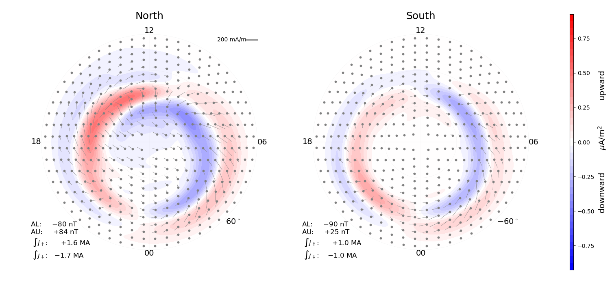

.. _usage:

Usage
=====
pyAMPS can be used to calculate model ionospheric currents and associated magnetic fields. Below we show the recommended approach for two different use cases: 1) calculations on a grid of magnetic coordinates for a fixed set of external conditions, and 2) calculations at one or more points as the external conditions change. The former is useful for working with and plotting global maps, and the latter is useful for comparison with point measurements in space and on ground.  

Calculations on grid - the AMPS class
-------------------------------------
The `AMPS` class is used for calculating magnetic field disturbances and currents on a grid: 

.. code-block:: python

    >>> # initialize by supplying a set of external conditions:
    >>> from pyamps import AMPS
    >>> m = AMPS(350, # Solar wind velocity in km/s 
                  -4, # IMF By (GSM) in nT
                  -3, # IMF Bz (GSM) in nT, 
                  20, # dipole tilt angle in degrees 
                  80) # F107_index

The member function `plot_currents` allows for a quick look at the polar current system in both hemispheres associated with the chosen external condiditions:

.. code-block:: python

    >>> m.plot_currents()

Through the `AMPS` object, the various parts of the current system can be calculated on a grid. For example, the upward current:

.. code-block:: python

    >>> Ju = m.get_upward_current()
    >>> # Ju will be evaluated at the following coords:
    >>> mlat, mlt = m.scalargrid

User-defined grids can also be used:

.. code-block:: python

    >>> import numpy as np 
    >>> mlat, mlt = np.array([75, -75]), np.array([12, 12])
    >>> Ju = m.get_upward_current(mlat, mlt)
    >>> Ju
    array([ 0.25088252, -0.05726114])

The following member functions work in the same way as `get_upward_current`:

`get_divergence_free_current_function`
  The divergence-free part of the horizontal current, represented as a scalar function that is similar to the equivalent current function which is often derived from ground magnetometer measurements.

`get_curl_free_current_potential`
  The field-aligned currents can be used to derive a curl-free horizontal current, by solving the current continuity equation. Since it is curl-free, it is the gradient of a potential. This function returns that potential.

`get_toroidal_scalar`
  The disturbance magnetic field is expressed as a sum of a poloidal and toroidal part, both of which relates to scalars. This function can be used to calculate the toroidal scalar (which relates to field-aligned currents). 

`get_poloidal_scalar`
  Same as above, only for the poloidal scalar (which relates to the divergence-free part of the horizontal currents). 

The above functions return scalar quantities. There are also functions that return vector quantities. The default grid for vector quantities is given by the `m.vectorgrid` parameter. The functions that return vector quantities are:

`get_divergence_free_current`
  The divergence-free part of the horizontal current, magnetic eastward and northward components

`get_curl_free_current`
  The curl-free part of the horizontal current, magnetic eastward and northward components

`get_total_current`
  The total horizontal current, the sum of curl-free and divergence-free parts, magnetic eastward and northward components. 

In addition, the following functions are available:

`get_ground_perturbation`
  Calculate ground magnetic field perturbations associated with an equivalent current that is equal to that returned by `get_divergence_free_current_function`. This function returns eastward and northward components, at a set of points provided by the user

`get_integrated_upward_current`
  Integrate the upward currents poleward of `m.minlat`. The function returns the integral of upward and downward currents in both hemispheres. 

`get_AE_indices`
  Calculate model auroral electrojet indices, AL and AU, in both hemispheres. This calculation is based on the same assumptions as in `get_ground_perturbation`

All calculations with the `AMPS` object depend on a height, which by default is 110 km. The horizontal currents are assumed to flow in a spherical shell at this height, and the field-aligned currents are mapped to this height. It can be changed at initialization. 

Calculations of time series
---------------------------
For comparison with magnetometer measurements, it is necessary to calculate the magnetic field at different positions (for example along a satellite orbit) with changing external parameters. We provide two functions to do such calculations: `get_B_space` and `get_B_ground`. The calculations are parallelized by use of the `dask` module. That means that the calculations are split in chunks and distributed in different threads. The size of each chunk is specified by the `chunksize` keyword, default 15000. Increasing it may reduce calculation time, but it will increase memory consumption. Reduce it to limit memory consumption. 

Calculations along satellite trajectory
.......................................
Use `get_B_space` to calculate time series of model magnetic field perturbations in space, above the horizontal current, for example along a satellite trajectory.

.. code-block:: python

    >>> from pyamps import get_B_space
    >>> import numpy as np
    >>> from datetime import datetime
    >>>
    >>> # make up some inputs. For the sake of example, they are all 
    >>> # equal, but in realistic cases they would vary:
    >>> N = 100000 # number of points that we want to use
    >>> v, By, Bz, tilt, f107 = [np.full(N, x) for x in [350, -4, -3, 20, 80]]
    >>> glat, glon, height = [np.full(N, x) for x in [80, 30, 450]]
    >>> time = np.full(N, datetime(2013, 11, 22, 12, 02, 29))
    >>>
    >>> # calculate the disturbance field for each point (this may take a minute):
    >>> Be, Bn, Bu = get_B_space(glat, glon, height, time, v, By, Bz, tilt, f107)
    >>> print Be.shape
    (100000,)

The outputs are the eastward, northward and upward geodetic components of the disturbance magnetic field. 

Calculations at ground
......................
On ground, the magnetic signature of the field-aligned currents are zero, and only the divergence-free part of the horizontal current can be detected. We can use the divergence-free part of the horizontal current implied by the model to calculate a corresponding magnetic field perturbation on ground. This is done in the `get_B_ground` function, demonstrated below. 

.. code-block:: python

    >>> from pyamps import get_B_ground
    >>> import numpy as np
    >>>
    >>> # make up some inputs. For the sake of example, they are all 
    >>> # equal, but in realistic cases they would vary:
    >>> N = 100000 # number of points that we want to use
    >>> v, By, Bz, tilt, f107 = [np.full(N, x) for x in [350, -4, -3, 20, 80]]
    >>> qdlat = 67.
    >>> height = 0.
    >>> mlt = np.full(N, 4.)
    >>>
    >>> # calculate the disturbance field for each point (this may take a minute):
    >>> Be, Bn, Bu = get_B_ground(qdlat, mlt, height, v, By, Bz, tilt, f107)
    >>> print Be.shape
    (100000,)

The outputs are eastward, northward and upward components in quasi-dipole coordinates. Notice that `get_B_ground` differs from `get_B_space` in that it takes magnetic coordinates (quasi-dipole latitude and magnetic local time) as input, instead of geographic coordinates, and that it returns magnetic components instead of geographic components.

Also notice that `qdlat` can be either a scalar or an array with the same size as the other inputs, and that `height` should always be a scalar. 

The calculations in `get_B_ground` depend on the height chosen for the horizontal current. This can be changed with the keyword `current_height`, and it is set to 110 km by default. 

